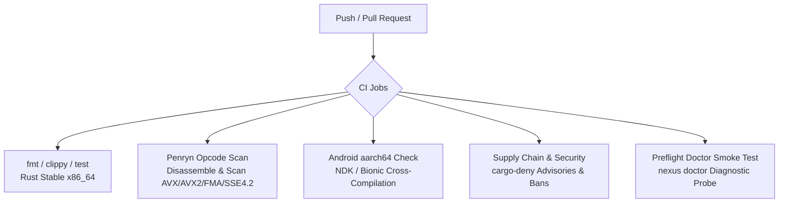
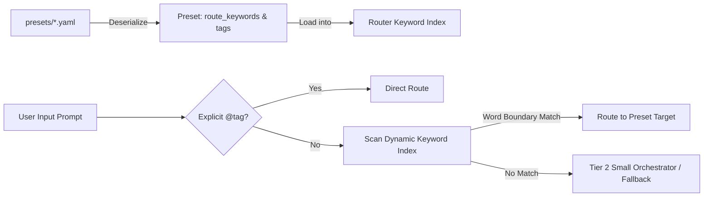
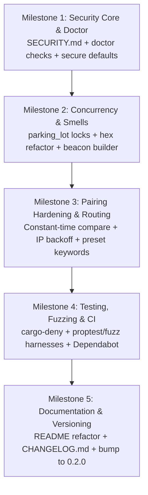

# Nexus-LLM Audit Remediation Plan: Architectural Improvements & Quality Hardening

> **Document Version:** 1.0.0  
> **Target System:** Nexus-LLM Distributed Inference Mesh  
> **Status:** Implementation Blueprint  
> **Related Documents:** [AUDIT_WEAKNESSES_PLAN.md](AUDIT_WEAKNESSES_PLAN.md), [DESIGN_SPEC.md](DESIGN_SPEC.md), [BUILD_PLAN.md](BUILD_PLAN.md)

---

## Executive Summary & Engineering Mandate

The external technical audit recognized Nexus-LLM as an unusually robust, hardware-verified distributed systems project with superior MoE flash-streaming capabilities and clean systems architecture. To transition the project from an advanced prototype into a production-grade, trustworthy open-source standard, the audit outlined **seven prioritized improvements**.

This document outlines the detailed architectural blueprints, concrete code changes, CI pipelines, fuzzing configurations, and documentation refactorings needed to execute every improvement claim.

Key objectives:
1. **Uncompromised Transparency & Security:** Explicitly document the threat model in `SECURITY.md` and eliminate timing side-channels.
2. **Robust Defense-in-Depth:** Fuzz all untrusted byte parsers (GGUF and UDP Beacons).
3. **Data-Driven Configurability:** Remove hardcoded English keywords in routing, delegating classification semantics to user presets.
4. **Professional, Grounded Documentation:** Refactor `README.md` to lead with a clean quickstart, state physical-hardware MoE accomplishments objectively without marketing hype, and present security mechanisms accurately.

---

## Improvement 1: Formal Threat Model Specification (`SECURITY.md`)

### 1.1 Objective & Context
To ensure operator trust and eliminate ambiguity, create a dedicated `SECURITY.md` in the repository root. This document formalizes the mesh's operational boundaries, cryptographic mechanisms, data privacy expectations, and vulnerability reporting procedures.

### 1.2 Structure & Content Blueprint for `SECURITY.md`

#### Section 1: Mesh Threat Model & Trust Boundaries
- **Network Boundary:** Nexus-LLM is designed for **Trusted Local Area Networks (LANs)** or **Encrypted Point-to-Point Overlay Networks** (e.g., WireGuard, Tailscale, SSH port forwarding, ADB USB tunnels).
- **Untrusted Environments Warning:** The mesh does NOT employ transport-layer encryption (TLS) by default. On untrusted, public, or roaming networks (e.g., coffee shop Wi-Fi), traffic must be routed through an encrypted tunnel or VPN.
- **Untrusted Input Boundaries:**
  - Raw UDP discovery packets on port `9999`.
  - HTTP control plane on port `9998`.
  - Model blobs downloaded from Hugging Face or shared over LAN HTTP.

#### Section 2: Cryptographic Guarantees vs. Non-Guarantees
| Guarantee | Provided By Nexus-LLM | Mechanism / Details |
| :--- | :--- | :--- |
| **Control Plane Authenticity** | **YES** | Ed25519 digital signatures over canonical HTTP request elements. |
| **Tamper Resistance / Integrity** | **YES** | SHA-256 body digests included in canonical signing message. |
| **Replay Protection** | **YES** | 120-second timestamp freshness window + LRU Nonce cache. |
| **Out-of-Band Mutual Pairing** | **YES** | 6-digit HMAC-SHA256 time-rotating PINs (`nexus pair`). |
| **Traffic Confidentiality (Encryption)**| **NO** | Payloads (prompts, tokens, model blobs) traverse the wire in cleartext HTTP. |

#### Section 3: Recommended Operator Hardening Guidelines
1. **Enforce Pairing:** Always keep `require_pairing = true` (the new default).
2. **Interface Binding:** When running on multi-homed or exposed machines, bind `api_host` to `127.0.0.1` and use SSH or ADB port forwarding:
   ```bash
   nexus tunnel forward --device <SERIAL> --local-port 8080 --remote-port 8080
   ```
3. **Key Isolation:** Ensure private key files at `~/.nexus/identity.key` are protected by `chmod 600` on Unix platforms.
4. **Web Gateway Protection:** If exposing the Web Hub (`nexus web`), set a strong non-default PIN or place behind a reverse proxy with TLS (Caddy / Nginx).

#### Section 4: Coordinated Vulnerability Disclosure
- Security issues must be reported privately via GitHub Security Advisories or directly to project maintainers.
- Response timeline commitments (triage within 48 hours, patch targets within 14 days).

---

## Improvement 2: Comprehensive CI Verification Pipeline (`.github/workflows/ci.yml`)

### 2.1 Current Status & Deficiencies
While `.github/workflows/ci.yml` currently contains `fmt`, `clippy -D warnings`, `cargo test --locked`, and `check_penryn_opcodes.sh`, several vital checks are absent:
- No automated supply-chain / vulnerability auditing (`cargo-deny` or `cargo-audit`).
- No preflight sanity check (`nexus doctor` smoke test).
- No automated Dependabot tracking for dependency health.

### 2.2 Proposed Modernized CI Architecture



### 2.3 Detailed Pipeline Implementation
1. **Add `deny.toml`** to root to check licenses and security advisories.
2. **Add `dependabot.yml`** in `.github/`.
3. **Enhance `.github/workflows/ci.yml`** with `cargo-deny` and `nexus doctor` smoke tests:

```yaml
  security-audit:
    name: Security & Advisory Audit
    runs-on: ubuntu-latest
    steps:
      - uses: actions/checkout@v4
      - uses: EmbarkStudios/cargo-deny-action@v2
        with:
          command: check advisories bans

  doctor-smoke-test:
    name: Doctor Diagnostics Smoke Test
    runs-on: ubuntu-latest
    steps:
      - uses: actions/checkout@v4
      - uses: dtolnay/rust-toolchain@stable
      - uses: Swatinem/rust-cache@v2
      - name: Run nexus doctor
        run: cargo run --locked --bin nexus -- doctor
```

---

## Improvement 3: Fuzzing Untrusted Input Parsers

### 3.1 Targeted Attack Surfaces
Nexus-LLM parses binary and structured payloads directly from untrusted sources:
1. **Network Discovery Packets (`src/discovery.rs`):** UDP port 9999 receives raw 64-byte datagrams from arbitrary LAN sources. `BeaconPacket::decode(&[u8])` parses magic, version, UUID, role, and strings.
2. **GGUF Binary Headers (`src/gguf.rs`):** `GgufFile::open_from_reader` reads binary files from disk or downloaded from remote endpoints. Malformed metadata lengths, negative counts, or cyclic arrays could cause out-of-memory or panics.

### 3.2 Concrete Fuzzing & Property Test Implementation Plan

#### Strategy A: Enhanced Property-Based Testing (`proptest`)
Add adversarial generation suites to `tests/test_discovery.rs` and create `tests/test_gguf_properties.rs`:
```rust
// tests/test_gguf_properties.rs
use nexus::gguf::GgufFile;
use proptest::prelude::*;
use std::io::Cursor;

proptest! {
    #[test]
    fn test_gguf_parser_never_panics_on_arbitrary_bytes(
        bytes in prop::collection::vec(any::<u8>(), 0..4096)
    ) {
        let mut cursor = Cursor::new(bytes);
        // Must return Ok or Err, NEVER panic
        let _ = GgufFile::open_from_reader(&mut cursor);
    }

    #[test]
    fn test_gguf_parser_with_valid_magic_and_hostile_metadata(
        version in 2u32..=3u32,
        tensor_count in any::<u64>(),
        kv_count in any::<u64>(),
        payload in prop::collection::vec(any::<u8>(), 0..2048)
    ) {
        let mut data = Vec::new();
        data.extend_from_slice(b"GGUF");
        data.extend_from_slice(&version.to_le_bytes());
        data.extend_from_slice(&tensor_count.to_le_bytes());
        data.extend_from_slice(&kv_count.to_le_bytes());
        data.extend_from_slice(&payload);

        let mut cursor = Cursor::new(data);
        let _ = GgufFile::open_from_reader(&mut cursor);
    }
}
```

#### Strategy B: Setup `cargo-fuzz` (libFuzzer) Infrastructure
1. Create `fuzz/` directory structure:
   - `fuzz/Cargo.toml`
   - `fuzz/fuzz_targets/fuzz_beacon.rs`
   - `fuzz/fuzz_targets/fuzz_gguf.rs`
2. Define fuzz harnesses:
```rust
// fuzz/fuzz_targets/fuzz_beacon.rs
#![no_main]
use libfuzzer_sys::fuzz_target;
use nexus::discovery::BeaconPacket;

fuzz_target!(|data: &[u8]| {
    let _ = BeaconPacket::decode(data);
});
```
3. Document running the fuzzer in `DEVELOPING.md`:
   ```bash
   cargo fuzz run fuzz_beacon -- -max_total_time=60
   ```

---

## Improvement 4: Cryptographic & Rate-Limiting Hardening of Node Pairing

### 4.1 Current Deficiencies in `handle_pair` & `node_identity.rs`
1. **Port-Hopping Rate-Limit Bypass:** In `src/control_plane_server.rs:1068-1079`, `allow_pair_attempt` tracks attempts by `SocketAddr`. An attacker can cycle their source port on every request to gain infinite attempts.
2. **Abrupt Cutoff / Timing Oracle:** After 10 attempts, it immediately returns a 429 response without exponential delay.
3. **Variable-Time Code Comparison:** In `src/node_identity.rs:189, 194`, pairing code verification uses standard string equality (`normalized == current`), which short-circuits on the first differing character, creating a theoretical timing leak.

### 4.2 Hardened Implementation Plan

#### 1. IP-Based Tracking with Exponential Backoff
Refactor rate limiting in `src/control_plane_server.rs`:
```rust
struct PairAttemptState {
    failure_count: u32,
    last_attempt: Instant,
    lockout_until: Instant,
}

// Map IP address, NOT SocketAddr
pair_attempts: Arc<parking_lot::Mutex<HashMap<std::net::IpAddr, PairAttemptState>>>
```
- Exponential backoff schedule:
  - 1–3 failed attempts: No delay.
  - 4–6 failed attempts: 2-second delay.
  - 7–9 failed attempts: 10-second delay.
  - 10+ failed attempts: 60-second lockout.

#### 2. Constant-Time Code Comparison
Use constant-time slice comparison in `src/node_identity.rs`:
```rust
pub fn verify_pairing_code(signing_key: &SigningKey, unix_secs: u64, code: &str) -> bool {
    let normalized = code.trim();
    if normalized.len() != 6 || !normalized.chars().all(|c| c.is_ascii_digit()) {
        return false;
    }
    let current = pairing_code(signing_key, unix_secs);
    let prev_window_secs = unix_secs.saturating_sub(PAIRING_CODE_WINDOW_SECS);
    let prev = pairing_code(signing_key, prev_window_secs);

    // Constant-time byte-level comparison
    constant_time_eq_6(normalized.as_bytes(), current.as_bytes())
        || constant_time_eq_6(normalized.as_bytes(), prev.as_bytes())
}

#[inline]
fn constant_time_eq_6(a: &[u8], b: &[u8]) -> bool {
    if a.len() != 6 || b.len() != 6 {
        return false;
    }
    let mut diff = 0u8;
    for i in 0..6 {
        diff |= a[i] ^ b[i];
    }
    diff == 0
}
```

---

## Improvement 5: Data-Driven Tier-1 Router Configuration via Presets

### 5.1 Current Problem: Hardcoded Substrings
In `src/router.rs:200-245`, routing relies on hardcoded static English slices:
```rust
const CODER_KEYWORDS: &[&str] = &["fn ", "def ", "class ", "sql", "select ", "git ", ...];
const VISION_KEYWORDS: &[&str] = &["image", "photo", "look at", ...];
```
- Substrings like `"select "` or `"git "` misfire on ordinary English dialogue ("Please select a model", "Can you git me a coffee?").
- Users cannot customize keywords for non-English prompts or domain-specific code.

### 5.2 Implementation Blueprint: Presets-Driven Routing



1. **Extend `Preset` in `src/preset.rs`:**
   ```rust
   pub struct Preset {
       pub name: String,
       pub description: String,
       pub template: ChatTemplate,
       pub temperature: f32,
       pub top_p: f32,
       pub max_tokens: usize,
       pub system_prompt: String,
       #[serde(default)]
       pub tags: Vec<String>,
       #[serde(default)]
       pub route_keywords: Vec<String>,
   }
   ```
2. **Update `presets/coder.yaml` & `presets/general.yaml`:**
   ```yaml
   name: "coder"
   tags: ["coder", "code", "dev"]
   route_keywords:
     - "struct "
     - "impl "
     - "def "
     - "fn "
     - "function "
     - "compile"
     - "quicksort"
     - "refactor"
   ```
3. **Word-Boundary Matching in `src/router.rs`:**
   Replace naive `lower.contains(kw)` with word-boundary awareness to avoid substring false positives (e.g. matching `git` only as a standalone word, not inside `digital` or `legitimate`).

---

## Improvement 6: Release Versioning, Artifacts & Changelog Strategy

### 6.1 Versioning Milestone Plan
- **Transition from `0.1.0`:** Bump package version in `Cargo.toml` to `0.2.0` (or `1.0.0-rc1`) to reflect completion of all 15 build milestones.
- **Adopt Semantic Versioning (SemVer 2.0.0):**
  - Major: Breaking protocol shifts or backward-incompatible control-plane changes.
  - Minor: New node capabilities, discovery features, or supervisor backends.
  - Patch: Bug fixes, Penryn opcode safety updates, security patches.

### 6.2 Create `CHANGELOG.md`
Adopt the standard [Keep a Changelog](https://keepachangelog.com/) format documenting:
- **[0.2.0] - Unreleased / Upcoming:**
  - *Added:* Security hardening, `SECURITY.md`, `nexus doctor` security probes.
  - *Added:* Data-driven preset routing keywords.
  - *Changed:* Default security posture changed to `require_pairing = true`.
  - *Changed:* Migrated from `std::sync` locks to `parking_lot` in control plane.
  - *Security:* Constant-time pairing code comparison, IP-based exponential backoff.
- **[0.1.0] - Historical Architecture Baseline:**
  - Initial distributed peer mesh, 15 engineering phases, MoE flash streaming, Penryn safety enforcements.

---

## Improvement 7: Grounded & Transparent `README.md` Refactoring (No Overselling)

### 7.1 Objective & Policy
Refactor `README.md` to eliminate marketing hyperbole and sales language. Let the technical metrics and code speak for themselves.

### 7.2 Specific Text Audits & Edits

| Current Overselling / Marketing Text | Objective Technical Replacement | Rationale |
| :--- | :--- | :--- |
| `## Breakthrough: MoE Flash Streaming with BigMoeOnEdge` | `## MoE Flash Streaming: Running Oversized Models on Mobile Devices` | "Breakthrough" is marketing language; describe what the technical feature does. |
| `state-of-the-art coding and reasoning capabilities` | `high-parameter coding and reasoning architectures` | "State-of-the-art" is an unquantified buzzword. |
| `immense appreciation to Helldez and the BigMoeOnEdge project` | `Technical Attribution: BigMoeOnEdge Integration` | Professional technical attribution with exact architecture description. |
| `6-Digit Terminal PIN Security: Secure authentication protecting control and chat endpoints` | `PIN Protection: 6-digit terminal PIN gate protecting local web endpoints against casual unauthorized LAN access` | Accurate representation of what a 6-digit PIN over cleartext HTTP actually provides. |
| Missing Quickstart at top | Insert `## Quickstart` immediately following the overview | Developers need installation commands within 5 seconds of opening the repository. |

### 7.3 Restructured README.md Table of Contents
1. **Overview & Supported Hardware Platforms** (Android Snapdragon 8 Gen 2, Penryn Core 2 Duo, Modern x86-64).
2. **Quickstart** (One-line setup script and first model run).
3. **MoE Flash Streaming with `bmoe-cli`** (Hardware verification logs on Galaxy S23 Ultra: 18.55 GB model on 12 GB RAM, ~2.35 tok/s).
4. **Mesh Architecture & Protocols** (UDP 9999 beacon, mDNS, Ed25519 control plane).
5. **Security & Threat Model** (Clear statement of cleartext LAN transport, Ed25519 signatures, link to `SECURITY.md`).
6. **Subcommands & Configuration Reference**.
7. **Testing, Fuzzing & Hardware Verification**.

---

## Implementation Sequence & Milestones



Each milestone is independently testable, verified via `cargo test --locked`, `cargo clippy`, and physical Penryn opcode checks.
