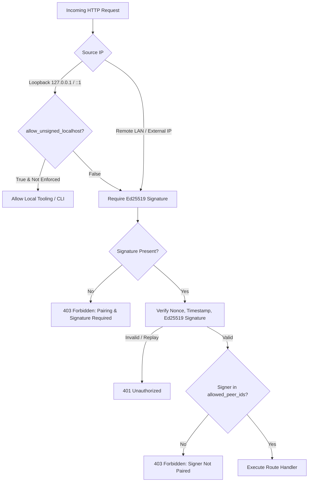

# Nexus-LLM Audit Remediation Plan: Weaknesses & Security Defenses

> **Document Version:** 1.0.0  
> **Target System:** Nexus-LLM Distributed Inference Mesh  
> **Status:** Implementation Blueprint  
> **Related Documents:** [AUDIT_IMPROVEMENTS_PLAN.md](AUDIT_IMPROVEMENTS_PLAN.md), [DESIGN_SPEC.md](DESIGN_SPEC.md), [BUILD_PLAN.md](BUILD_PLAN.md)

---

## Executive Summary & Engineering Mandate

An external technical audit of the Nexus-LLM codebase validated the project's core systems programming achievements (including physical-hardware MoE flash streaming on mobile devices, Penryn opcode safety, typed error models, and binary beacon discovery). However, the audit identified **five significant weaknesses** ranging from insecure default security postures to concurrency hazards and dependency deprecations.

This document details the verified claims, root causes, threat analyses, and comprehensive, step-by-step implementation plans to remediate each weakness. In alignment with our strict core directives:
1. **Security Must Be High by Default:** The application must never compromise node safety or expose unauthenticated control interfaces to local networks out of the box.
2. **Quality & Zero Panics:** Async executors must not be exposed to thread-blocking or poisoned lock hazards.
3. **No Overselling:** Security guarantees must be accurate, explicit, and backed by verifiable code and documentation.

---

## Weakness 1: Insecure Security Defaults (Unsigned & Unpaired by Default)

### 1.1 Verified Claim & Code Inspection
- **Claim:** `pairing_enforced()` returns `false` by default because `require_pairing` is initialized to `false` and `allowed_peer_ids` is empty. Consequently, `verify_control_request` silently accepts unsigned requests (generating a dummy nil-signer), and `authorize_privileged_signer` is a no-op. Privileged operations—such as remote model loading/unloading, blob fetching, and knowledge base mutations—are open to any device on the LAN without authentication.
- **Affected Files:**
  - `src/config.rs:804-818` (`SecurityConfig::default()`, `pairing_enforced()`)
  - `src/trust_auth.rs:80-82` (`pairing_enforced()`), `241-251` (`verify_control_request()`), `274-289` (`authorize_privileged_signer()`)
  - `src/control_plane_server.rs:345-368, 468-491, 578-601, 716-739, etc.`

```rust
// src/config.rs (Current Default)
impl Default for SecurityConfig {
    fn default() -> Self {
        Self {
            protocol_version: default_security_protocol_version(),
            require_pairing: false,       // <-- Default is disabled!
            allowed_peer_ids: Vec::new(), // <-- Default is empty!
            paired_peers: Vec::new(),
        }
    }
}

// src/trust_auth.rs (Current Bypass)
if !headers.contains_key(HDR_SIGNATURE) {
    if pairing_enforced(security) {
        return Err(AuthError::PairingRequired);
    }
    // Silently permits unauthenticated requests!
    return Ok(AuthHeaders {
        timestamp: unix_timestamp_now(),
        nonce: String::new(),
        signer_id: Uuid::nil(),
        signature: [0u8; 64],
    });
}
```

### 1.2 Threat Analysis
- **Remote Model Hijacking / DOS:** Any unauthenticated device connected to the same Wi-Fi or LAN subnet can dispatch `POST /nexus/control/v1/model/load` with hostile parameters or memory allocations, exhausting device RAM, tripping the Android Low Memory Killer (LMK), or forcing constant eviction of operational models.
- **Unauthorized Data & Storage Writes:** Any machine on the LAN can push arbitrary document chunks into the node's local `redb` database via `POST /nexus/control/v1/kb/store` or trigger background downloads of multi-gigabyte models via `POST /nexus/control/v1/blob/fetch`.
- **Contradiction with Documentation:** While documentation and the TUI emphasize "Signed Security" and Ed25519 trust, unconfigured nodes in reality run completely unauthenticated.

### 1.3 Target Architecture & Implementation Strategy



1. **Secure by Default:**
   - Change `SecurityConfig::default()`:
     ```rust
     require_pairing: true, // Default to true
     ```
   - For fresh installations, remote nodes MUST complete the 6-digit out-of-band pairing handshake (`nexus pair`) before they can issue control-plane directives.
2. **First-Class Localhost Exemption:**
   - Requests originating strictly from loopback addresses (`127.0.0.1` or `::1`) for local CLI commands, local UI bindings, and local automated test suites are treated as trusted local operator traffic *if and only if* `allow_unsigned_localhost: true` is configured.
   - All network traffic originating from non-loopback addresses (any LAN or WAN peer) MUST be signed with Ed25519 and verified against `allowed_peer_ids`.
3. **Explicit Insecure LAN Mode for Developers:**
   - If an operator specifically desires an open LAN test environment without pairing, they must explicitly opt in via configuration:
     ```toml
     [network.security]
     require_pairing = false
     allow_unpaired_lan = true # Explicit warning logged on daemon start
     ```
   - When `allow_unpaired_lan` is false, `pairing_enforced(&self)` returns `true` even if `allowed_peer_ids` is empty, ensuring that no remote request passes without cryptographic authorization.

### 1.4 Step-by-Step Code Changes
1. **`src/config.rs`:**
   - Add `allow_unpaired_lan: bool` (default: `false`) to `SecurityConfig`.
   - Update `Default` implementation: `require_pairing: true`.
   - Update `pairing_enforced(&self)`:
     ```rust
     pub fn pairing_enforced(&self) -> bool {
         if self.allow_unpaired_lan {
             return self.require_pairing || !self.allowed_peer_ids.is_empty();
         }
         // Secure default: pairing is always enforced for remote peers
         true
     }
     ```
2. **`src/trust_auth.rs`:**
   - In `verify_control_request`:
     - If `peer_ip` is loopback and `allow_unsigned_localhost` is enabled, permit loopback requests.
     - For all other requests, if `!headers.contains_key(HDR_SIGNATURE)`, immediately return `Err(AuthError::PairingRequired)`.
   - In `authorize_privileged_signer`:
     - Reject `signer_id.is_nil()` unconditionally for remote callers.
     - Require that `security.allowed_peer_ids.contains(&signer_id)` unless the request is verified loopback.
3. **`src/control_plane_server.rs`:**
   - Log an explicit `WARN` during server initialization if `security.allow_unpaired_lan` is active.
4. **Integration Tests Update:**
   - Update test suites (`tests/test_trust.rs`, `tests/test_mesh_integration.rs`) to either test loopback flows with localhost exemption or initialize test nodes with paired keypairs.

---

## Weakness 2: Cleartext HTTP, Unencrypted Payloads & Missing Threat Model

### 2.1 Verified Claim & Code Inspection
- **Claim:** All control-plane, data, and streaming endpoints run over cleartext HTTP/1.1 (`hyper::server::conn::http1`). Ed25519 provides signature authentication and payload integrity, but confidentiality is zero: chat prompt tokens, generation outputs, vector chunks, and raw model weights traverse local Wi-Fi unencrypted. Additionally, no `SECURITY.md` exists, and `nexus doctor` issues no warnings regarding network posture.
- **Affected Files:**
  - `src/control_plane_server.rs:181` (cleartext hyper listener)
  - `src/control_plane.rs:200-220` (unencrypted reqwest HTTP dispatch)
  - `src/doctor.rs:77-100` (missing security configuration checks)
  - Repo root: absence of `SECURITY.md`.

### 2.2 Threat Analysis
- **Eavesdropping on Untrusted Networks:** If a user runs Nexus-LLM on a laptop or phone connected to university, coffee shop, or corporate Wi-Fi:
  - Any attacker running Wireshark/tcpdump can intercept full LLM chat conversations and knowledge base documents.
  - The 6-digit web hub PIN or token headers sent in cleartext HTTP could be observed by packet sniffers if operators access `nexus web` over an open network.
- **False Sense of Security:** Without a threat model, users might assume that "cryptographic Ed25519 signatures" implies end-to-end encryption of their prompt content.

### 2.3 Target Architecture & Implementation Strategy
1. **Publish `SECURITY.md` Documenting the Mesh Threat Model:**
   - Define exact trust boundaries: Nexus-LLM operates on the assumption of a **Trusted Private LAN** or **Encrypted Tunnel (WireGuard / Tailscale / SSH / ADB)**.
   - Detail cryptographic guarantees: Ed25519 provides **Authenticity, Integrity, and Non-Replayability**, but NOT **Confidentiality**.
   - Prescribe secure operational patterns:
     - For mobile tethering: use the integrated `nexus tunnel` (ADB port forwarding over USB) rather than open Wi-Fi.
     - For roaming workstations: bind `api_host` to `127.0.0.1` and use a WireGuard overlay mesh or Tailscale.
     - For public web access: front the Web Gateway with TLS termination (Nginx, Caddy, or Cloudflare Tunnel).
2. **Implement Security Diagnostic Checks in `nexus doctor`:**
   - Add `check_security_configuration(config: &NexusConfig) -> Vec<DoctorCheck>`:
     - **Check 1 (Pairing Enforced):** `WARN` if `security.require_pairing == false` or `security.allow_unpaired_lan == true`.
     - **Check 2 (Interface Binding):** `WARN` if `api_host` is `0.0.0.0` or a public IP when `require_pairing` is off.
     - **Check 3 (Key File Permissions):** On Unix, inspect `~/.nexus/identity.key`. `FAIL` or `WARN` if file permissions are broader than `0o600`.
     - **Check 4 (Web Gateway PIN):** Check that web PIN authentication is enabled when gateway is exposed outside localhost.

### 2.4 Step-by-Step Code Changes
1. **Create `SECURITY.md`** at repository root (detailed in [AUDIT_IMPROVEMENTS_PLAN.md](AUDIT_IMPROVEMENTS_PLAN.md)).
2. **`src/doctor.rs`:**
   ```rust
   pub fn check_security(config: &NexusConfig) -> Vec<DoctorCheck> {
       let mut checks = Vec::new();
       // 1. Pairing enforcement
       if !config.network.security.pairing_enforced() {
           checks.push(DoctorCheck {
               name: "security_pairing",
               severity: CheckSeverity::Warn,
               detail: "Pairing is disabled or permissive; remote LAN nodes can issue control requests without authentication.".to_string(),
           });
       } else {
           checks.push(DoctorCheck {
               name: "security_pairing",
               severity: CheckSeverity::Ok,
               detail: format!("Pairing enforced ({} paired peers).", config.network.security.paired_peers.len()),
           });
       }
       // 2. Key permissions on Unix
       #[cfg(unix)]
       {
           use std::os::unix::fs::PermissionsExt;
           let key_path = crate::node_identity::NodeIdentity::default_key_path();
           if key_path.exists() {
               if let Ok(meta) = std::fs::metadata(&key_path) {
                   let mode = meta.permissions().mode() & 0o777;
                   if mode != 0o600 {
                       checks.push(DoctorCheck {
                           name: "identity_key_permissions",
                           severity: CheckSeverity::Warn,
                           detail: format!("Key file {:?} has loose permissions {:04o} (expected 0600).", key_path, mode),
                       });
                   } else {
                       checks.push(DoctorCheck {
                           name: "identity_key_permissions",
                           severity: CheckSeverity::Ok,
                           detail: "Private key permissions strictly 0600.".to_string(),
                       });
                   }
               }
           }
       }
       checks
   }
   ```
3. Wire `check_security(config)` into `run_doctor(config)` in `src/doctor.rs`.

---

## Weakness 3: Synchronous Blocking Locks in Tokio Async Context

### 3.1 Verified Claim & Code Inspection
- **Claim:** `std::sync::Mutex` and `std::sync::RwLock` are held across async route handlers, accompanied by `.expect("... lock")` assertions.
- **Affected Locations in `src/control_plane_server.rs`:**
  - Line 58: `pub config: Arc<std::sync::RwLock<NexusConfig>>`
  - Line 60: `pub nonce_cache: Arc<Mutex<NonceCache>>`
  - Line 61: `pair_attempts: Arc<Mutex<HashMap<SocketAddr, (u32, Instant)>>>`
  - Lines 348, 471, 580, 638, 719, 779, 835, 884, 933, 983, 1032, 1069, 1112, 1149: `.expect("config lock")` and `.expect("pair attempts lock")`
  - `src/trust_auth.rs:256`: `nonce_cache.lock().expect("nonce cache poisoned")`

### 3.2 Failure Modes & Concurrency Hazards
1. **Lock Poisoning Panics:** Under Rust's standard library primitives, if a worker thread panics while holding an `std::sync::Mutex` or `std::sync::RwLock`, the lock enters a permanently *poisoned* state. Any subsequent `.expect("... lock")` call in any future HTTP request will panic immediately. This triggers a cascading crash across all hyper request-handling green threads.
2. **Worker Thread Starvation:** Even though critical sections are brief, calling blocking locks inside Tokio worker threads can block the OS thread from processing other ready tasks when contention spikes under high load.

### 3.3 Implementation Plan: Migration to `parking_lot` / `tokio::sync`
1. **Adopt `parking_lot::RwLock` & `parking_lot::Mutex` for Synchronous Hot Paths:**
   - `parking_lot` locks do NOT suffer from lock poisoning. Calling `.read()` or `.write()` never returns a `PoisonError`, eliminating the entire category of `.expect("... lock poisoned")` crashes.
   - `parking_lot` primitives are faster, smaller (1 word), and have adaptive spinning that outperforms `std::sync` on multi-core systems.
2. **Replace Blocking Locks Held Across Async Calls with `tokio::sync`:**
   - Where a lock might need to be held across an `.await` boundary, use `tokio::sync::RwLock` or `tokio::sync::Mutex`.
   - In `ControlPlaneContext`:
     - Replace `nonce_cache: Arc<Mutex<NonceCache>>` with `Arc<parking_lot::Mutex<NonceCache>>`.
     - Replace `config: Arc<std::sync::RwLock<NexusConfig>>` with `Arc<parking_lot::RwLock<NexusConfig>>` or `tokio::sync::RwLock<NexusConfig>`.
     - Replace `pair_attempts` with `Arc<parking_lot::Mutex<HashMap<IpAddr, (u32, Instant)>>>`.
3. **Audit and Eliminate all `.expect(...)` on Locks:**
   - Remove every instance of `.expect("config lock")` in `control_plane_server.rs`.
   - With `parking_lot`, `ctx.config.read()` directly yields the read guard without unwrapping.

---

## Weakness 4: Dependency Drift & Supply Chain Auditing

### 4.1 Verified Claim & Dependency Inspection
- **Claim:**
  - `thiserror = "1.0"`: `thiserror 2.0` has been released with compile-time improvements.
  - `rand = "0.8"`: `rand 0.9` is current.
  - `serde_yaml = "0.9"`: **Archived and unmaintained upstream** by dtolnay.
  - `ratatui = "0.29"` & `crossterm = "0.28"`.
  - Missing `cargo-deny` / `cargo-audit` in CI; missing Dependabot.
- **Affected Files:**
  - `Cargo.toml`
  - `.github/workflows/ci.yml`
  - `.github/dependabot.yml` (absent)

### 4.2 Remediation & Migration Blueprint

#### 1. Replace Deprecated `serde_yaml` with `serde_yml`
`serde_yaml` is no longer maintained. We will migrate to `serde_yml`, the community drop-in replacement that addresses CVEs and keeps up with modern Rust toolchains.
- In `Cargo.toml`:
  ```toml
  serde_yml = "0.0.12"
  ```
- In `src/preset.rs`:
  ```rust
  use serde_yml as serde_yaml; // Seamless alias or direct import
  ```

#### 2. Introduce `deny.toml` and `cargo-deny` in CI
Create `deny.toml` at repo root to enforce:
- **Banned Crates:** Disallow known duplicate crates or unmaintained dependencies.
- **Advisories:** Automatically scan for CVEs via the RustSec advisory database.
- **Licenses:** Enforce permissible open-source licenses (MIT, Apache-2.0, BSD-3-Clause).
Add to `.github/workflows/ci.yml`:
```yaml
  security-audit:
    name: Security & Advisory Audit
    runs-on: ubuntu-latest
    steps:
      - uses: actions/checkout@v4
      - uses: EmbarkStudios/cargo-deny-action@v2
```

#### 3. Enable Dependabot (`.github/dependabot.yml`)
Create `.github/dependabot.yml`:
```yaml
version: 2
updates:
  - package-ecosystem: "cargo"
    directory: "/"
    schedule:
      interval: "weekly"
    open-pull-requests-limit: 5
  - package-ecosystem: "github-actions"
    directory: "/"
    schedule:
      interval: "monthly"
```

#### 4. Planned `thiserror` & `rand` Upgrades
- `thiserror 2.0` is a straightforward update with no breaking syntax changes for standard enum error derive macros.
- `rand 0.9` changed trait distributions; test and verify `fresh_nonce()` and pairing code generators against `rand 0.9` during a planned minor bump.

---

## Weakness 5: Code Smells Sweep

### 5.1 Smell A: Duplicate Beacon Construction in `src/discovery.rs`
- **Location:** Lines 693, 759, and 954 in `src/discovery.rs`.
- **Analysis:** Each branch creates `BeaconPacket` with identical 12-field boilerplate, reading thermal index, status flags, and node metadata.
- **Remediation:** Extract a unified constructor method on `DiscoveryService`:
```rust
impl DiscoveryService {
    pub async fn create_current_beacon(&self) -> BeaconPacket {
        let profile = SystemProfile::probe();
        let status = *self.status_flags.read().await;
        let rpc_port = *self.rpc_port.read().await;
        let active_model = self.active_model.read().await.clone();
        let thermal_index = Self::probe_thermal_index();
        let local_role = self.cfg().node.role.clone();

        BeaconPacket {
            magic: BEACON_MAGIC,
            version: BEACON_VERSION,
            role: NodeRole::from_str_role(&local_role),
            status,
            uuid: self.node_uuid,
            api_port: self.cfg().network.api_port,
            rpc_port,
            ram_mb: profile.total_memory_mb,
            free_ram_mb: profile.available_memory_mb,
            backend: profile.backend,
            thermal_index,
            active_model,
        }
    }
}
```

### 5.2 Smell B: Hand-rolled, Inefficient `hex_encode` and Duplicated `hex_decode`
- **Location:** `src/node_identity.rs:148-156`, `src/trust_auth.rs:188-196`.
- **Analysis:**
  ```rust
  pub fn hex_encode(bytes: &[u8]) -> String {
      bytes.iter().map(|b| format!("{b:02x}")).collect()
  }
  ```
  This creates an intermediate `String` allocation for every single byte (64 allocations for an Ed25519 signature, 32 for a SHA-256 digest), performing `O(N)` heap reallocations. In addition, `hex_decode` is duplicated with inconsistent error types.
- **Remediation:**
  Implement a single, high-performance, single-allocation hex module in `src/node_identity.rs` and re-export it across the crate:
```rust
const HEX_CHARS: &[u8; 16] = b"0123456789abcdef";

pub fn hex_encode(bytes: &[u8]) -> String {
    let mut out = String::with_capacity(bytes.len() * 2);
    for &b in bytes {
        out.push(HEX_CHARS[(b >> 4) as usize] as char);
        out.push(HEX_CHARS[(b & 0x0f) as usize] as char);
    }
    out
}

pub fn hex_decode(hex: &str) -> Result<Vec<u8>, &'static str> {
    let hex = hex.trim();
    if hex.len() % 2 != 0 {
        return Err("odd hex string length");
    }
    let mut bytes = Vec::with_capacity(hex.len() / 2);
    let raw = hex.as_bytes();
    for chunk in raw.chunks_exact(2) {
        let hi = hex_nibble(chunk[0])?;
        let lo = hex_nibble(chunk[1])?;
        bytes.push((hi << 4) | lo);
    }
    Ok(bytes)
}

#[inline]
fn hex_nibble(c: u8) -> Result<u8, &'static str> {
    match c {
        b'0'..=b'9' => Ok(c - b'0'),
        b'a'..=b'f' => Ok(c - b'a' + 10),
        b'A'..=b'F' => Ok(c - b'A' + 10),
        _ => Err("invalid hex character"),
    }
}
```

### 5.3 Smell C: `probe_thermal_index` Undocumented Heuristic
- **Location:** `src/discovery.rs:583-595`.
- **Analysis:** Reads only `/sys/class/thermal/thermal_zone0/temp` and maps 40°C–80°C to 0–100. On devices with multiple sensors or non-SoC zone 0, this may report inaccurate metrics.
- **Remediation:**
  1. Add comprehensive doc comments clarifying that this is a **heuristic indicator** for dynamic load balancing and placement ranking.
  2. Add multi-zone fallback checks: if `thermal_zone0` is missing or reads 0, check `thermal_zone1` or Android battery temperature (`/sys/class/power_supply/battery/temp`).
  3. Clamp smoothly with fallback to 0 when sensors are unavailable.

### 5.4 Smell D: Agent Noise in Comments (`// Continuous:`)
- **Location:**
  - `src/control_plane_server.rs:67`
  - `src/mdns.rs:31`
  - `src/trust_auth.rs:219`
  - `src/ui/hub/commands.rs:1005`
- **Remediation:** Replace robotic tool comments with standard, professional Rust doc comments explaining architectural rationale:
  - *Before:* `// Continuous: keep flat ctor; reshaping into a builder is out of scope for hygiene.`
  - *After:* `/// Constructs a new control plane context with explicit parameter assignments.`

---

## Verification & Regression Test Matrix

| Weakness Area | Test File / Target | Verification Command | Expected Success Criteria |
| :--- | :--- | :--- | :--- |
| **Weakness 1 (Security Defaults)** | `tests/test_trust.rs` | `cargo test --test test_trust` | Remote unsigned calls return 403 `PairingRequired`. Paired keys pass. Loopback calls pass when configured. |
| **Weakness 2 (Cleartext & Doctor)** | `tests/test_phase1.rs`, CLI | `cargo run --bin nexus -- doctor` | Doctor outputs `[OK] security_pairing: Pairing enforced` when configured; outputs warning if disabled. |
| **Weakness 3 (Async Locks)** | Integration tests & clippy | `cargo clippy --all-targets -- -D warnings` | No lock poisoning panics; clean `parking_lot` compilation. |
| **Weakness 4 (Dependencies)** | `cargo test`, CI | `cargo test --locked` | `serde_yml` deserializes presets cleanly; Dependabot file validated. |
| **Weakness 5 (Code Smells)** | `src/node_identity.rs` tests | `cargo test --lib node_identity` | Single-allocation `hex_encode` round-trips correctly; beacon builder deduplication passes. |
