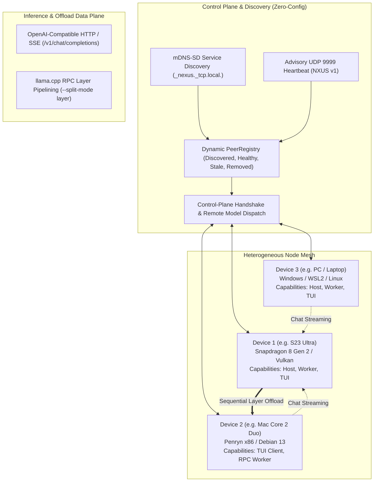

# Nexus-LLM: System Architecture & Technical Specification

**Document ID:** SPEC-NEXUS-2026-REV5  
**Topology:** Symmetric N-Node Peer Mesh  
**Supported Platforms:** Android Termux (ARM64), Debian 13 / Linux (x86-64), macOS, Windows PowerShell, Windows WSL2  

---

## 1. System Overview & Architectural Topology

Nexus-LLM is an autonomous, cross-platform terminal orchestrator and distributed LLM runtime for heterogeneous edge devices. Instead of hardcoding static roles to specific physical machines, Nexus-LLM implements a **symmetric peer mesh**:
- **Any connected device** can serve as an **Inference Host**, an **RPC Worker**, or an **Interactive TUI Client**.
- **Hardware safety bounds** are strictly enforced dynamically on each individual node (e.g. Android LMK 75% available RAM limit on Termux, Penryn SSE4.1 instruction safety on older x86 machines, and user-configured memory ceilings).
- **Target Node Selection**: An operator can launch models on any connected device directly from the TUI Hub and chat with the active model from any node.



---

## 2. Dynamic Node Capability Matrix

| Runtime Target | Primary Acceleration | Memory Safety Mechanism | Typical Roles |
|---|---|---|---|
| **Android Termux (ARM64)** | Adreno GPU via Vulkan (`GGML_VULKAN=1`) or ARM CPU (`dotprod` + `i8mm`) | `/proc/meminfo` dynamic LMK guard (`Model + KV < 0.75 * MemAvailable`) | Compute Host, RPC Worker, TUI Client |
| **Legacy x86 Workstations (e.g. Core 2 Duo)** | CPU (MMX, SSE, SSE2, SSE3, SSSE3, SSE4.1) | Strict Penryn flag enforcement (`-avx,-avx2,-fma,-sse4.2`); user-configured RAM cap (e.g. 1800 MB) | Interactive TUI Client, RPC Worker |
| **Modern x86 / ARM Workstations (Windows / WSL2 / Linux)** | GPU (CUDA/Vulkan) or Multi-Threaded CPU | OS available memory probing; configured allocation caps | Compute Host, RPC Worker, Interactive TUI Client |

---

## 3. Acceleration Hierarchy & Memory Safety

Nexus-LLM enforces an explicit acceleration and memory waterfall whenever a model is scheduled on an execution node:

```text
[Model Execution Request (Local or Remote)]
                 │
                 ▼
[Memory Safety Check: Model Size + KV Cache < 0.75 * MemAvailable (or configured cap)]
                 │
                 ├───► INSUFFICIENT RAM:
                 │         │
                 │         ├───► RPC Worker Available?
                 │         │         │
                 │         │         ├───► YES: Plan sequential layer split (--split-mode layer)
                 │         │         └───► NO:  Reject with MemoryCapExceeded error
                 │
                 ▼ WITHIN BUDGET
[Hardware Capability Probe]
                 │
                 ├───► Vulkan Runtime Available?
                 │         ├───► YES: Launch llama-server with -ngl 99 (Full GPU Offload)
                 │         └───► Runtime Init Failed? Fallback automatically to CPU Mode (-ngl 0)
                 │
                 └───► CPU Only:
                           Launch llama-server with -ngl 0 and recommended thread count
```

---

## 4. Control-Plane Protocol & Model Dispatch

In addition to the advisory 64-byte UDP beacon (port 9999) and mDNS-SD browsing, the Nexus control plane handles verified state synchronization and remote process dispatch over HTTP.

### Endpoints
- **`GET /cluster/state`**: Returns verified node identity, protocol version, active role, current model, and allocatable memory budget.
- **`POST /cluster/model/load`**: Dispatches a model execution request to the target node.
  ```json
  {
    "model_path": "qwen2.5-coder-7b.gguf",
    "context_size": 4096,
    "gpu_layers": 99,
    "rpc_workers": ["192.168.1.105:50052"]
  }
  ```
- **`POST /cluster/model/unload`**: Gracefully terminates the running `llama-server` process on that node.

---

## 5. TUI Target Node Selection & Dynamic Chat Routing

### Target Node Selector Modal (`[F2: Models]`)
When an operator selects a model in the Models view:
1. The TUI queries `PeerRegistry` for all active, healthy nodes capable of inference.
2. A selector modal is presented:
   - `[1] Local Machine (Host)`
   - `[2] Samsung Galaxy S23 (Termux - Vulkan, 8.5 GB allocatable)`
   - `[3] Linux PC (CUDA, 16.0 GB allocatable)`
3. On selection, the local TUI either spawns `ProcessSupervisor` directly (if Local) or transmits `POST /cluster/model/load` to the remote peer.

### Dynamic Chat Routing (`[F1: Chat]`)
- The chat engine dynamically binds to whichever node is actively hosting the loaded model.
- If the model is loaded on the phone, all connected TUI clients (on Mac, PC, or another phone) automatically update their chat client base URL to point to the phone's inference endpoint (`http://<PHONE_IP>:8080`).
- Token streaming is delivered via standard Server-Sent Events (SSE).

---

## 6. Configuration Specification (`~/.nexus/config.toml`)

```toml
[node]
id = "auto"                         # Persisted UUID generated on first run
name = "auto"                       # Human-readable hostname
role = "host"                       # Default role: host, client, worker, or member
models_dir = "~/nexus-models"
presets_dir = "~/.nexus/presets"

[hardware.acceleration]
prefer_gpu = true                   # Prioritize Vulkan / GPU
gpu_layers = 99                     # Max layer offload
fallback_to_cpu = true              # Drop to CPU if GPU initialization fails
cpu_threads = 6                     # Node-specific thread count

[hardware.safety]
max_ram_usage_percent = 75          # Dynamic LMK ceiling on Android
mmap = true
mlock = false

[network]
api_host = "0.0.0.0"
api_port = 8080
discovery_port = 9999
broadcast_interval_ms = 2000
peer_timeout_ms = 6000
static_peers = []

[network.discovery]
enabled = true
protocol_version = 1
broadcast_interval_ms = 2000
peer_timeout_ms = 6000
max_peers = 64

[network.discovery.mdns]
enabled = true
service_type = "_nexus._tcp.local."

[network.security]
protocol_version = 1
require_pairing = false          # Auto-set true after first successful pair (Phase 9)
allowed_peer_ids = []
# paired_peers = [{ id = "...", public_key_hex = "..." }]  # Filled by POST /pair

# Phase 9: Ed25519 signing key at ~/.nexus/node.key (mode 0600). Control-plane
# POST bodies use headers Nexus-Signature-* over canonical:
#   nexus-control-v1\n{METHOD}\n{PATH}\n{sha256_hex(body)}\n{timestamp}\n{nonce}\n{signer_id}
# Pairing: target shows a 6-digit code (5-minute window); initiator POST /nexus/control/v1/pair.

[cluster]
rpc_port = 50052
max_rpc_ram_mb = 1800               # Default local ceiling if acting as an RPC worker
auto_offload = true
prefer_adb_tunnel = false
```
