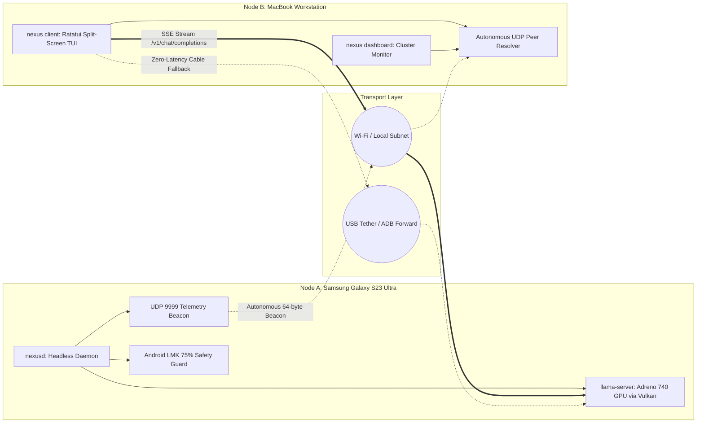

# Nexus-LLM

**Nexus-LLM** is an ultra-lightweight distributed LLM orchestrator, headless compute daemon, and terminal user interface (TUI) written in Rust. It is engineered for heterogeneous edge computing across asymmetric hardware:

- **Node A (Primary Compute Host)**: Samsung Galaxy S23 Ultra (Qualcomm Snapdragon 8 Gen 2, 12 GB RAM, Adreno 740 GPU via Vulkan, Android 14+ Termux ARM64).
- **Node B (Workstation Client)**: Apple MacBook / Linux (`macrowave`, Intel Core 2 Duo P7550 @ 2.26 GHz, 3.6 GiB RAM, Debian 13 Trixie x86-64).



---

## Architecture & Hardware Safeguards

### 1. Legacy x86 Hardware Safety (Mac Intel Core 2 Duo P7550)
The Intel P7550 is a Penryn-generation 64-bit CPU. Any instruction newer than **SSE4.1** (such as AVX, AVX2, FMA, F16C, POPCNT, or SSE4.2) causes an immediate fatal `SIGILL` (Illegal Instruction) crash.

Nexus-LLM enforces this baseline in `.cargo/config.toml`:
```toml
[target.x86_64-unknown-linux-gnu]
rustflags = ["-C", "target-feature=-avx,-avx2,-fma,-sse4.2"]
```
This guarantees that compiling and running on your Mac generates safe, crash-free Penryn binaries.

### 2. Android LMK Memory Safety Guard (Galaxy S23 Ultra)
Android's Low Memory Killer (LMK) sends `SIGKILL` (Signal 9) to userland processes when memory pressure spikes. Nexus-LLM reads `/proc/meminfo` before every model launch and blocks requests where:
$$\text{Model File Size} + \text{Exact KV Cache} > 0.75 \times \text{MemAvailable}$$
It prevents process termination and safeguards device stability.

### 3. Vulkan GPU Offload with Transparent CPU Fallback
- Prioritizes full GPU offload (`-ngl 99`) to the Adreno 740 GPU via Vulkan.
- Actively monitors process initialization: if Vulkan device binding fails, the supervisor automatically restarts `llama-server` in ARM NEON/DotProd CPU mode (`-ngl 0 -t 6`).

---

## Quick Start Guide

### Prerequisites

| Machine | Required Packages |
| :--- | :--- |
| **Node A (Galaxy S23 Ultra - Termux)** | `pkg update && pkg install -y rust clang git libllvm vulkan-tools` |
| **Node B (MacBook / Debian 13)** | `sudo apt update && sudo apt install -y cargo rustc git build-essential` |

---

### Step 1: Setting up Node A (Galaxy S23 Ultra)

Inside Termux on your Galaxy S23 Ultra:

```bash
# 1. Navigate to project directory
cd ~/local-server

# 2. Build binaries (optimized for Snapdragon 8 Gen 2)
cargo build --release

# 3. Download a quantized model (e.g. Qwen 2.5 Coder 1.5B or 7B)
./target/release/nexus download \
  "https://huggingface.co/Qwen/Qwen2.5-Coder-1.5B-Instruct-GGUF/resolve/main/qwen2.5-coder-1.5b-instruct-q4_k_m.gguf" \
  -o ~/nexus-models/qwen2.5-coder-1.5b.gguf

# 4. Inspect model metadata and verify Android LMK compatibility
./target/release/nexus inspect -m ~/nexus-models/qwen2.5-coder-1.5b.gguf -c 4096

# 5. Start the headless inference host daemon
./target/release/nexusd --model ~/nexus-models/qwen2.5-coder-1.5b.gguf -c 4096
```

`nexusd` will:
- Initialize the Vulkan-accelerated `llama-server` on port `8080`.
- Broadcast autonomous 64-byte telemetry beacons over UDP port `9999` every 2,000 ms.

---

### Step 2: Setting up Node B (MacBook / Debian 13)

#### How to Clone from your Phone to your Mac

You can clone this repository to your Mac using either Git over SSH or by pushing to GitHub.

##### Option A: Direct Clone from Phone via Local Wi-Fi (No GitHub Required)
In Termux on your phone, start SSH server:
```bash
pkg install -y openssh
sshd
whoami   # Outputs your Termux user (e.g. u0_a363)
ip addr show wlan0 | grep "inet " # Shows your phone IP (e.g. 192.168.1.50)
passwd   # Set a password if not set
```

On your Mac:
```bash
git clone ssh://<TERMUX_USER>@<PHONE_IP>:8022/data/data/com.termux/files/home/local-server ~/nexus-llm
cd ~/nexus-llm
```

##### Option B: Via GitHub
In Termux on your phone:
```bash
git remote add origin https://github.com/<YOUR_USER>/nexus-llm.git
git branch -M main
git push -u origin main
```

On your Mac:
```bash
git clone https://github.com/<YOUR_USER>/nexus-llm.git ~/nexus-llm
cd ~/nexus-llm
```

---

#### Building & Running on your Mac

On your Mac:
```bash
cd ~/nexus-llm

# Build the client binary (guarded by Penryn SSE4.1 flags in .cargo/config.toml)
cargo build --release --bin nexus
```

---

### Step 3: Connecting Node B to Node A

Nexus-LLM provides three seamless connection methods:

#### Method 1: Autonomous Zero-Configuration Discovery (Recommended)
Make sure both devices are on the same Wi-Fi network. You do **not** need to type an IP address!

```bash
# Launch interactive split-screen TUI chat
./target/release/nexus client
```

`nexus` will automatically listen on UDP port 9999, validate the 64-byte CRC-16 beacon from your S23 Ultra, and immediately connect.

#### Method 2: Direct IP Specification
If subnet UDP broadcast is blocked by your Wi-Fi router (common on guest networks):
```bash
./target/release/nexus client --host http://<PHONE_IP>:8080
```

#### Method 3: Persistent Static Host or Peer in config.toml
If your Wi-Fi router isolates clients from receiving UDP broadcasts, you can configure your phone's IP once in `~/.nexus/config.toml` on your Mac:
```toml
[network]
default_host = "http://<PHONE_IP>:8080"
# or add to static peers fallback list:
static_peers = ["<PHONE_IP>"]
```
Then simply launch `./target/release/nexus client` without any flags.

#### Method 4: USB Cable / ADB Port Forwarding (Ultra Low-Latency)
Connect your S23 Ultra to your MacBook via USB cable with USB Debugging enabled:

On your Mac:
```bash
# Forward local port 8080 to phone port 8080 over USB
adb forward tcp:8080 tcp:8080

# Connect instantly with zero Wi-Fi latency
./target/release/nexus client --host http://localhost:8080
```

---

## Interactive Interfaces & Tools

### Phase 0 Compatibility Baseline

Before changing discovery or peer identity, validate the existing behavior on the
actual target devices. Host-side Rust tests cover deterministic protocol and
fallback behavior:

```bash
cargo test --test test_discovery
cargo test --test test_cluster_rpc
cargo test --test test_phase1
```

Record the following device matrix separately from host CI results:

| Check | Node A: Termux ARM64 | Node B: Debian x86-64 | Secondary Termux | Linux peer |
| :--- | :---: | :---: | :---: | :---: |
| UDP beacon receive/send | required | required | required | required |
| Wi-Fi client isolation/filtering | required | required | required | observe |
| Multiple interfaces | required | required | observe | observe |
| IPv4 and scoped IPv6 | required | required | observe | required |
| Concurrent local listener | required | required | required | required |

For each run, record the interface, subnet, discovery port, peer UUID, packet
counts, and whether static/ADB fallback was required. Do not treat cross
compilation as proof of Android multicast behavior.

Capture release binary size and idle RSS/CPU after a fixed settle interval for
`nexusd` on Node A and `nexus`/the RPC worker on Node B. Record the target triple
and compiler flags, and verify the Penryn build does not enable AVX, AVX2, FMA,
F16C, POPCNT, or SSE4.2. An actual llama.cpp smoke test is optional and must use
a tiny checksum-verified GGUF built with the same architecture-safe flags; the
deterministic Rust tests do not require llama.cpp to be installed.

### 1. Unified Interactive Hub (Default Experience)
Starting `nexus` with no arguments launches the full-screen Ratatui Unified Hub:
```bash
./target/release/nexus
```

**Global Navigation & Controls**:
- `F1` - `F5` / `Tab` / `Shift+Tab`: Switch between views instantly:
  - `[F1: 💬 Chat]`: Full-screen streaming conversation with auto-scroll and multi-turn history.
  - `[F2: 📦 Models]`: Split-pane model browser with real-time zero-copy GGUF inspection, exact KV cache calculation, Android LMK memory badges (`[OK]`, `[RPC]`, `[OOM]`), and `[Enter]` to load & chat.
  - `[F3: 🖥️ Dashboard]`: Cluster monitor showing GPU/Vulkan status, CPU temperature, RAM usage, and active peer nodes.
  - `[F4: 🔗 USB Tunnel]`: Live ADB USB status monitor, one-key port forwarding (`F`), and teardown (`T`).
  - `[F5: ⚙️ Settings]`: In-app settings editor for GPU offload, CPU threads, RAM ceiling, and RPC limits. Toggle with `Space`, adjust with `Left`/`Right`, save with `S`.
- `Ctrl+C`: Gracefully shut down active model supervisors and exit.

**Safe Model Hot-Swapping**:
When a model is already active, selecting another model and pressing `Enter` displays an in-app confirmation dialog (`[Y / N]`). Confirming safely terminates the active process, re-evaluates memory headroom, and loads the new model without needing to restart the application.

---

### 2. Standalone Subcommands (Scripting & Automation)

For headless servers, automated scripts, or dedicated workstations:

```bash
# Direct TUI Chat Client
./target/release/nexus client

# Batch execution (pipes or script automation)
./target/release/nexus client --prompt "Explain Rust lifetimes in two sentences."

# Cluster Performance Dashboard
./target/release/nexus dashboard

# Local Model Directory Scanner
./target/release/nexus models

# Zero-Copy GGUF Inspection
./target/release/nexus inspect -m ~/nexus-models/model.gguf -c 4096

# RPC Compute Worker on Node B (MacBook)
./target/release/nexus rpc --port 50052 --mem 1800

# ADB USB Tunnel Management
./target/release/nexus tunnel setup
./target/release/nexus tunnel status
./target/release/nexus tunnel teardown
```

---

## Directory Structure

```
~/nexus-llm/
├── Cargo.toml               # Package targets and dependencies
├── .cargo/
│   └── config.toml          # Target compiler flags (Snapdragon vs Penryn)
├── AGENTS.md                # System guidelines and architecture rules
├── DESIGN_SPEC.md           # Network protocols and binary packet layout
├── BUILD_PLAN.md            # Phased execution milestones
├── README.md                # Setup and user documentation
├── presets/
│   ├── coder.yaml           # Systems programming persona (ChatML)
│   └── general.yaml         # Conversational assistant persona (Llama-3)
├── src/
│   ├── main.rs              # CLI router, default Unified Hub entry point
│   ├── daemon.rs            # Headless supervisor daemon (nexusd)
│   ├── config.rs            # TOML configuration engine (~/.nexus/config.toml)
│   ├── sysinfo.rs           # /proc parser & Android LMK memory guard
│   ├── supervisor.rs        # Asynchronous llama-server process manager
│   ├── discovery.rs         # 64-byte UDP beacon protocol & peer cache
│   ├── client.rs            # OpenAI HTTP/SSE streaming client
│   ├── cluster.rs           # Distributed RPC layer pipelining coordinator
│   ├── tunnel.rs            # ADB USB port forwarding & reverse supervisor
│   ├── gguf.rs              # Zero-copy GGUF v2/v3 metadata parser
│   ├── downloader.rs        # Chunked HTTP resume downloader with SHA-256
│   ├── preset.rs            # YAML persona & prompt formatting templates
│   └── ui/
│       ├── hub.rs           # Unified interactive Ratatui Hub controller
│       ├── chat.rs          # Ratatui split-screen streaming chat view
│       ├── models_view.rs   # Split-pane model browser & GGUF inspector
│       ├── settings_view.rs # In-app configuration editor
│       ├── tunnel_view.rs   # Interactive USB ADB tunnel monitor
│       ├── dashboard.rs     # Cluster performance monitor TUI
│       └── models.rs        # Local model directory scanner
└── tests/
    ├── test_phase1.rs       # System profiling & memory guard test suite
    ├── test_discovery.rs    # UDP 9999 beacon & SSE stream test suite
    ├── test_cluster_rpc.rs  # Distributed RPC layer offload & ADB tests
    ├── test_gguf_metadata.rs# GGUF parsing & persona templates test suite
    ├── test_ui.rs           # Headless Ratatui widget render test suite
    └── test_hub_ui.rs       # Unified Hub, navigation, and settings test suite
```

---

## Running the Automated Test Suite

All 44 automated tests can be run at any time to verify system integrity across both platforms:

```bash
# Run all phase verification suites
cargo test --test test_phase1
cargo test --test test_discovery
cargo test --test test_cluster_rpc
cargo test --test test_gguf_metadata
cargo test --test test_ui
cargo test --test test_hub_ui
```

---

## Troubleshooting

### 1. `nexus client` says "No host peer discovered on the network"
- Ensure both devices are on the same Wi-Fi subnet.
- Check if your router blocks UDP broadcast packets. If so, connect directly using `./target/release/nexus client --host http://<PHONE_IP>:8080` or use USB cable via `adb forward tcp:8080 tcp:8080`.

### 2. Termux terminates `llama-server` unexpectedly
- Check available RAM using `./target/release/nexus info`.
- Make sure you pass models through `./target/release/nexus inspect` or `check` to verify they fit under the 75% memory cap.
- Close heavy background apps on your phone before running models larger than 7B.

### 3. Mac shows `SIGILL (Illegal Instruction)`
- This occurs if code was compiled without Penryn flags. Verify `.cargo/config.toml` contains `-C target-feature=-avx,-avx2,-fma,-sse4.2` and rebuild with `cargo clean && cargo build --release`.
